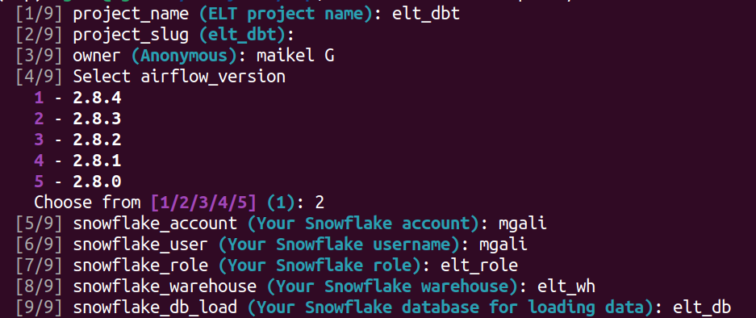
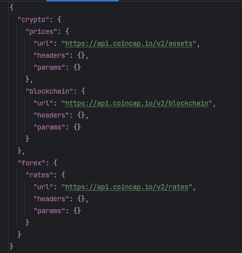

# ELT Template

`elttemplate` is a project created using the [cookiecutter](https://cookiecutter.readthedocs.io/) library.

`elttemplate` allows you to focus on the most important tasks: creating your DAGs and your dbt models.

*Feel free to modify the code to adapt it to your usage.*

## Installation

```bash
conda create -n elt_dbt python=3.10 -y
conda activate elt_dbt
```

```bash
pip install cookiecutter
```

## Creating the ELT Template

```bash
cookiecutter git@github.com:gmaikel/elttemplate.git
```

Then configure your project:



Based on your choices, your ELT pipeline template for Airflow dbt will be created.

## Usage

### Extract and Load (EL)

In the `dags/extract_load/data/schema.json` file, you can simply add your data schemas for the `Load` part, like this:



In this example, we have two schemas: *crypto* (containing two tables, *prices* and *blockchain*) and *forex* (containing a table *rates*).

In the `dags/elt_dag.py` DAG file, you can then add a Python operator for each schema in the *extract* group:

```python
extract_forex = PythonOperator(
            task_id='extract_forex',
            python_callable=extract_schema,
            op_kwargs={'schema_name': 'forex'}
        )
```

Then add a Python operator for each schema in the *load* group:

```python
load_forex = PythonOperator(
            task_id='load_forex',
            python_callable=load_schema,
            op_kwargs={'schema_name': 'forex'}
        )
```

### Transform (T)

Next, configure your dbt project and create your models in the dbt project located in the `dags/transforms/models` folder.

### Launching

```bash
docker compose up -d
```

Then access the [Airflow UI](http://localhost:8080/) (username and password are both 'airflow') and create variables and connection :

- **Creating the `password`(Snowflake password) variable**: Admin -> Variables

- **Creating a Snowflake connection `db_conn`**: Admin -> Connections

Finally, trigger your DAG.

## Author
[Maikel G](https://github.com/gmaikel/)

