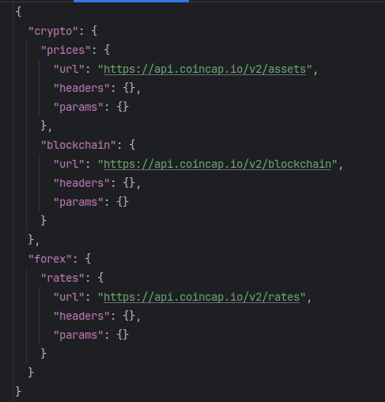

# {{cookiecutter.project_name}}

This project aims to establish a data pipeline, an **ELT** (Extract, Load, Transform) process, utilizing Airflow as the orchestrator, dbt for transformation, and Snowflake as the data warehouse.

## Snowflake Configuration

Begin by configuring Snowflake, including the role, creating the database, the warehouse, etc.

Copy and execute these commands in a SQL worksheet within Snowflake.

```sql
USE ROLE accountadmin;

CREATE ROLE IF NOT EXISTS {{cookiecutter.snowflake_role}};
GRANT ROLE elt_role to USER {{cookiecutter.snowflake_user}};

-- Data warehouse 
CREATE WAREHOUSE IF NOT EXISTS {{cookiecutter.snowflake_warehouse}}; 

-- Data database
CREATE DATABASE IF NOT EXISTS {{cookiecutter.snowflake_db_transform}};
CREATE DATABASE IF NOT EXISTS {{cookiecutter.snowflake_db_load}};

-- Grant privileges to the role
GRANT USAGE ON WAREHOUSE {{cookiecutter.snowflake_warehouse}} TO ROLE {{cookiecutter.snowflake_role}};

GRANT ALL ON DATABASE {{cookiecutter.snowflake_db_load}} TO ROLE {{cookiecutter.snowflake_role}};
GRANT ALL ON DATABASE {{cookiecutter.snowflake_db_transform}} TO ROLE {{cookiecutter.snowflake_role}};
```

**Create your different tables in 
the load database {{cookiecutter.snowflake_db_load}}**

## Extract and Load (EL)

In the `dags/extract_load/data/schema.json` file, simply add your data schemas for the `Load` part, as shown:



For example, we have two schemas: *crypto* (with tables *prices* and *blockchain*) and *forex* (with a table *rates*).

In the `dags/elt_dag.py` DAG file, add a Python operator for each schema in the *extract* group:

```python
extract_forex = PythonOperator(
            task_id='extract_forex',
            python_callable=extract_schema,
            op_kwargs={'schema_name': 'forex'}
        )
```

Then add a Python operator for each schema in the *load* group:

```python
load_forex = PythonOperator(
            task_id='load_forex',
            python_callable=load_schema,
            op_kwargs={'schema_name': 'forex'}
        )
```

## Transform (T)

Configure your dbt project and create models in the dbt project located in the `dags/transforms/models` folder.

## Launching

```bash
docker compose up -d
```

Then access the [Airflow UI](http://localhost:8080/) (both username and password are 'airflow') and create variables and connections:

- **Creating the variable `password` (Snowflake password)**: Admin -> Variables

Finally, trigger your DAG.

## Author
[Maikel G](https://github.com/gmaikel/)